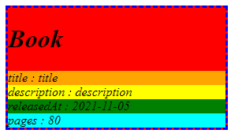

# htmlimg

a better way to representing data (json suck)

clone and run ./gradlew publishToMavenLocal

for represent object use `@Htmling` annotation for ignore some field use `@Ignore` annotation

# examples

1)

```java

@Htmling(getterPrefix = "")
// by default getterPrefix equals "get", but record provide getters with the same name as fields
public record Book(String title, String description) {

}

  // some method
  Book book = new Book("title", "description");
return HtmlingUtil.htmling(book);
```

result:

```html

<div>
  <div>title : title</div>
  <div>description : description</div>
</div>
```

2)

```java

@Htmling(getterPrefix = "", styles = {
    @Style(property = CSSProperty.BACKGROUND_COLOR, value = "red"),
    @Style(property = CSSProperty.BORDER, value = "medium dashed blue"),
    @Style(property = CSSProperty.FONT_STYLE, value = "italic")
})
public record Book(
    @Property(styles = {@Style(property = CSSProperty.BACKGROUND_COLOR, value = "orange")})
    String title,
    @Property(styles = {@Style(property = CSSProperty.BACKGROUND_COLOR, value = "yellow")})
    String description,
    @Property(styles = {@Style(property = CSSProperty.BACKGROUND_COLOR, value = "green")})
    LocalDate releasedAt,
    @Property(styles = {@Style(property = CSSProperty.BACKGROUND_COLOR, value = "cyan")})
    int pages,
    @Ignore String secretInfo
) {

}
```

result:

```html

<div style="background-color:red;border:medium dashed blue;font-style:italic;">
  <h1>Book</h1>
  <div style="background-color:orange;">title : title</div>
  <div style="background-color:yellow;">description : description</div>
  <div style="background-color:green;">releasedAt : 2021-11-05</div>
  <div style="background-color:cyan;">pages : 80</div>
</div>
```



3)

```java

@Htmling(tag = HTMLTag.UL, title = @Property(value = "amazing book", tag = HTMLTag.LI, styles = {
    @Style(property = CSSProperty.FONT_WEIGHT, value = "bold")
}), styles = {
    @Style(property = CSSProperty.BACKGROUND_COLOR, value = "red")
})
public static class Book {

  @Property(value = "amazing title", tag = HTMLTag.LI, styles = {
      @Style(property = CSSProperty.FONT_SIZE, value = "30px")
  })
  private String title;

  @Property(tag = HTMLTag.LI)
  private String description;

  @Property(value = "release date", tag = HTMLTag.LI)
  private LocalDate releasedAt;

  // getters setters and constructor
}
```

result

```html

<ul classname="Book" style="background-color:red;">
  <li title="" style="font-weight:bold;">amazing book</li>
  <li field="title" style="font-size:30px;">amazing title : The Cake in the Sky</li>
  <li field="description">description : Without description</li>
  <li field="releasedAt">release date : 1995-01-01</li>
</ul>
```

